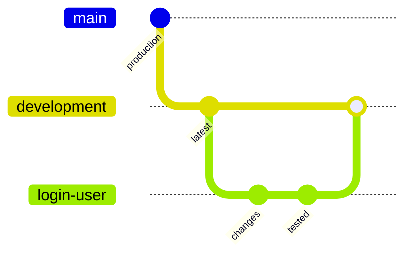

# RemindU

**Developer setup guide**


---

## Table of Contents

- [Prerequisites](#prerequisites)
- [Getting Started](#getting-started)
- [Running the App](#running-the-app)
- [Managing Packages](#managing-packages)
- [Claude Code Setup](#claude-code-setup)
- [Command Reference](#command-reference)
- [Git & GitHub Workflow](#git--github-workflow)
- [Commit Message Format](#commit-message-format)

---

## Prerequisites

This project uses **Bun** as its package manager and script runner instead of npm.

| Tool    | Purpose                          | Install                                                        |
| ------- | -------------------------------- | -------------------------------------------------------------- |
| **Bun** | Package manager, faster installs | [bun.com/docs/installation](https://bun.com/docs/installation) |

> [!NOTE]
> Bun replaces `npm install` / `package-lock.json` with `bun install` / `bun.lock`. Do not use npm or yarn in this repo, as mixed lockfiles cause dependency drift.

> [!IMPORTANT]
> Expo's CLI and Metro bundler still run on Node.js under the hood. Keep a current Node.js LTS installed alongside Bun.

---

## Getting Started

**1. Install Bun** for your operating system using the link above.

**2. Install dependencies.** This creates the `node_modules` folder and a `bun.lock` file.

```shell
bun install
```

---

## Running the App

Start the Expo development server:

```shell
bun expo start
```

Once the server is running, open the app on a device or emulator from the terminal prompt:

| Key | Action            |
| --- | ----------------- |
| `r` | Reload the app    |
| `j` | Open the debugger |

---

## Managing Packages

Always use Bun to add or remove dependencies.

```shell
# Add a package
bun add <package-name>

# Add a dev dependency
bun add -d <package-name>

# Remove a package
bun remove <package-name>
```

---

## Claude Code Setup

If you use **Claude Code** for development, install the Expo plugin. It gives Claude access to Expo's official documentation.

```shell
claude plugin install expo@claude-plugins-official
```

---

## Command Reference

| Task                                | Command                                              |
| ----------------------------------- | ---------------------------------------------------- |
| Install dependencies                | `bun install`                                        |
| Start Expo dev server               | `bun expo start`                                     |
| Add a package                       | `bun add <package-name>`                             |
| Add a dev dependency                | `bun add -d <package-name>`                          |
| Remove a package                    | `bun remove <package-name>`                          |
| Install Expo plugin for Claude Code | `claude plugin install expo@claude-plugins-official` |

---

## Git & GitHub Workflow

Every change in this project follows one branching model. Follow it exactly.

### Branches

| Branch                      | Purpose                                         | Rules                                                                              |
| --------------------------- | ----------------------------------------------- | ---------------------------------------------------------------------------------- |
| `main`                      | Production                                      | **Never commit, edit or push directly.**                                           |
| `development`               | Head branch. Every feature starts from here.    | Only receives completed and tested features by merging the feature branch into it. |
| `<feature-name>` (example: `login-user`) | One branch per feature             | Created from the latest `development`. Named after the feature in a short, lowercase, hyphen-separated form. |



### Step-by-Step (example feature: `login-user`)

**1. Start from `development` and pull the latest code.**

```shell
git switch development
git pull
```

**2. Create the feature branch.**

```shell
git switch -c login-user
```

**3. Make changes, then commit and push on the feature branch.** Repeat as often as needed.

```shell
git add .
git commit -m "feat(auth): add login form"
git push -u origin login-user
```

**4. Feature complete: push the latest code.**

```shell
git push
```

**5. Switch to `development` and pull the latest.**

```shell
git switch development
git pull
```

**6. Switch back to the feature branch and merge `development` into it.** Resolve conflicts if there are any, confirm the app still works, then push.

```shell
git switch login-user
git merge development
git push
```

**7. Switch to `development` and merge the feature branch into it.**

```shell
git switch development
git merge login-user
git push
```

### Rules

- Never work directly on `main` or `development`. All work happens on a feature branch.
- Always create a feature branch from the **latest** `development` (pull first).
- Always merge `development` into your feature branch and test **before** merging the feature into `development`.
- One feature per branch. Keep branch names short and descriptive.

---

## Commit Message Format

This project follows [Conventional Commits](https://www.conventionalcommits.org). It keeps `git log` readable and works with automated changelogs and versioning later.

### Structure

```
<type>(<scope>): <subject>

<body>

<footer>
```

Only the first line (`type` and `subject`) is required. The scope, body and footer are optional.

### Types

| Type       | Use for                                                |
| ---------- | ------------------------------------------------------ |
| `feat`     | A new feature or user-facing capability                |
| `fix`      | A bug fix                                              |
| `refactor` | Code restructuring with no behavior change             |
| `perf`     | A performance improvement                              |
| `style`    | Formatting only (whitespace, semicolons, lint fixes)   |
| `docs`     | README or documentation changes                        |
| `test`     | Adding or fixing tests                                 |
| `chore`    | Maintenance: dependency bumps, config, cleanup         |
| `build`    | Build system or Expo/EAS config changes               |
| `ci`       | CI/CD pipeline changes                                 |
| `revert`   | Reverting a previous commit                            |

> [!WARNING]
> `style` means code formatting, not UI styling. Changing a button's padding or color is a `feat` or a `fix`. Using `style` for visual changes makes the history misleading.

### Scope

The scope is optional. Use a short area name such as `auth`, `ui` or `deps` when it adds clarity, and skip it when it doesn't.

### Rules

1. **Write the subject in imperative mood:** "add login form", not "added" or "adds". It should complete the sentence "If applied, this commit will ___".
2. **Use lowercase and no trailing period.** Keep the subject to 50 characters or fewer. 72 is the hard limit.
3. **The body explains why, not what.** The diff already shows what changed. Wrap lines at 72 characters.
4. **One logical change per commit.** Do not mix a bug fix, a refactor and a new feature in one commit.
5. **Reference issues in the footer:** `Closes #14`.
6. **Mark breaking changes** with `!` after the type (`feat(api)!: ...`) or a `BREAKING CHANGE:` footer.

### Examples

**Good**

```
feat(auth): add login form with email and password
fix(auth): prevent duplicate submit on slow network
refactor(auth): move token storage into a custom hook
chore(deps): upgrade expo sdk
docs: add git workflow to readme
```

**With a body and footer**

```
fix(auth): prevent duplicate login requests

Tapping the login button twice on a slow connection sent two
requests and created two sessions. Disable the button while the
request is pending.

Closes #14
```

**Bad**

| Message          | Problem                                             |
| ---------------- | --------------------------------------------------- |
| `fixed stuff`    | Says nothing about what was fixed or where          |
| `login done`     | Not a change description, and no type               |
| `WIP`            | Useless in history. Squash or amend before merging  |
| `Update App.tsx` | Describes the file, not the change                  |